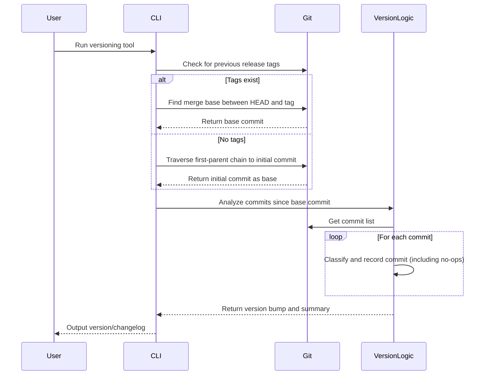

# vnext

**vnext** is a fast Rust CLI tool that analyzes your project's Git commit history using conventional commit conventions to automatically compute your next semantic version. It streamlines release management by deciding whether to bump the major, minor, or patch version solely from commit messages, making it ideal for any project regardless of language or ecosystem.

## Motivation

Version management has traditionally been a manual, subjective process prone to inconsistency and human bias. Emotionless versioning—where version numbers are determined by objective rules rather than human judgment—eliminates these issues by creating a standardized, predictable release process. This approach removes debates about what constitutes a "major" or "minor" change, prevents version stagnation due to fear of incrementing major versions, and ensures version numbers accurately reflect the nature of changes.

Beyond just determining version numbers, conventional commits serve a dual purpose: they communicate changes in plain English that can be automatically compiled into changelogs. These changelogs provide valuable documentation that is surfaced by dependency management tools like Renovate, allowing consuming developers to understand exactly what changes to expect with each version update. This creates a seamless information flow from commit message to version number to changelog to dependency update notification, enhancing transparency and trust throughout the development ecosystem.

Semantic-release is a powerful tool for automated versioning and changelog generation in the Node.js ecosystem, but it's tightly bound to Node and depends on the presence of a package.json, often introducing unnecessary overhead. While alternative tools exist, few offer the same streamlined experience. To address this gap, vnext was created—a lightweight, language-agnostic utility designed to parse Git commit messages and output the next semantic version. It adheres to the Unix philosophy of "do one thing well," making it an ideal choice for CI/CD pipelines across any tech stack.

## Features

- **Automated Version Calculation:**
   vnext scans your Git commit history (starting from the last version tag in `v*.*.*` format) and examines each commit message using predefined regular expressions. This means you can create any tag number from your current code base (e.g., `v1.2.3`) and vnext will use that as the starting point for future version calculations. It follows these rules:

   - **Major Version:**
      If a commit message is marked as a major change (with `major:`) or contains `BREAKING CHANGE:` at the start of the first line of the commit body, vnext triggers a major version bump. This resets the minor and patch numbers. Note that `BREAKING CHANGE:` must appear at the beginning of the first line of the commit body (right after the commit title and an empty line) to trigger a major version bump.
      
      **Example of a commit message that triggers a major version bump:**
      ```
      feat: add new authentication system
      
      BREAKING CHANGE: Users will need to re-authenticate after this update
      ```
      
      **Examples that will NOT trigger a major version bump:**
      ```
      feat: add new feature
      
      This feature includes BREAKING CHANGE: in the middle of a line
      ```
      
      ```
      feat: add new feature
      
      This is the first line of the body.
      BREAKING CHANGE: This is not the first line of the body
      ```

   - **Minor Version:**  
      In the absence of major changes, if any commit message signals the introduction of a new feature—typically using the `feat:` prefix—vnext bumps the minor version and resets the patch number.

   - **Patch Version:**  
      If neither major nor minor changes are detected, but there’s at least one commit marked as a bug fix (usually indicated by `fix:`), vnext increments the patch version.

   - **No-Ops:**  
      Some commits (such as those labeled with `chore:`, `noop:`, or other non-functional changes) are ignored in the version calculation. These commits are treated as no-ops and do not trigger any version bump.

   **Note on Manual Version Bumps:**
   The prefixes like `major:`, `minor:`, and `noop:` are considered "escape hatches" and not technically semantic versioning based on the semantics of the changes. They're included for convenience when you need to explicitly control version bumps outside the standard conventional commit types. While they're handy tools, relying primarily on semantic commit types (`feat:`, `fix:`, etc.) and `BREAKING CHANGE:` notations is more aligned with true semantic versioning principles.

   This simple yet robust mechanism makes vnext ideal for integrating into CI/CD pipelines, regardless of the project's language or ecosystem.
- **Language-Agnostic:**  
  No Node.js, npm, or package.json required – works with any codebase - it's all based on git.
- **Simplicity First:**  
  Outputs just the next semantic version. Combine it with your preferred release process.
- **Unix Philosophy:**  
  A small, focused tool that does one thing well.

## Sequence Diagram(s)



## Installation

### Using ubi

1. **Install ubi:**  
   Ensure you have ubi installed by running:
   ```bash
   mkdir -p ~/.ubi/bin
   echo 'export PATH="$HOME/.ubi/bin:$PATH"' >> ~/.zshrc  # or your preferred shell profile
   ```
2. **Install vnext with ubi:**  
   ```bash
   ubi --project unbounded-tech/vnext --in ~/.ubi/bin
   ```

### Building from Source

1. **Clone the repository:**
   ```bash
   git clone https://github.com/unbounded-tech/vnext.git
   cd vnext
   ```
2. **Build the project:**
   ```bash
   # Standard build (uses system OpenSSL)
   cargo build --release
   
   # Build with vendored OpenSSL (standalone binary)
   cargo build --release --features vendored
   ```
   The compiled binary will be located at `target/release/vnext`.

   > **Note:** The `vendored` feature statically links OpenSSL, creating a standalone binary that works on systems without OpenSSL installed. This is recommended for distribution but increases build time.

## Usage

After installation or building from source, run:
```bash
vnext help
```
To compute the next version based on your Git commit history, simply run:
```bash
vnext
```
This will output the new semantic version, ready for use in your release pipelines.

### Generating a Changelog

To generate a changelog based on your commit history, use the `--changelog` flag:

```bash
vnext --changelog
```

This will output a formatted changelog that includes all commits since the last version tag, organized by their impact on versioning. For example:

```
### What's changed in v1.2.0

* feat: add new authentication system
* fix: resolve login issue with special characters
* chore: update dependencies
```

#### Including GitHub Contributor Information

You can include GitHub contributor information in the changelog by using the `--github` flag along with `--changelog`:

```bash
vnext --changelog --github
```

**Note:** When the repository is hosted on GitHub, the `--github` flag is automatically enabled when using `--changelog`. You can still manually disable it by using `--no-github` if needed.

This will add the GitHub username of the commit author to each entry in the changelog:

```
### What's changed in v1.2.0

* feat: add new authentication system (by @johndoe)
* fix: resolve login issue with special characters (by @janedoe)
* chore: update dependencies (by @devuser)
```

For private repositories, you'll need to set the `GITHUB_TOKEN` environment variable with a valid GitHub personal access token:

```bash
export GITHUB_TOKEN=your_github_token
vnext --changelog --github
```

The changelog includes the commit messages and preserves multi-line commit bodies with proper indentation:

```
### What's changed in v2.0.0

* feat: redesign user interface

  This commit completely overhauls the UI with a new design system.
  - Improved accessibility
  - Better mobile support

* fix: resolve performance issues in data processing
```

For breaking changes, the changelog will include the breaking change notice:

```
### What's changed in v3.0.0

* feat: migrate to new API

  BREAKING CHANGE: This removes support for the legacy API endpoints
```

This flag is particularly useful in CI/CD pipelines to automatically generate release notes. The shared GitHub workflow at [unbounded-tech/workflow-vnext-tag](https://github.com/unbounded-tech/workflow-vnext-tag) uses this flag to generate and save a CHANGELOG.md file during the release process.

### Starting from a Specific Version

If you want to start versioning from a specific version number, simply create a Git tag with that version:

```bash
# Tag the current commit with a specific version
git tag v2.5.0

# Future runs of vnext will use this as the starting point
vnext  # Might output 2.5.1, 2.6.0, or 3.0.0 depending on commits since the tag
```

This allows you to initialize your versioning at any point, which is especially useful when adopting vnext in an existing project.

## Developer Guide

### Building and Running

1. **Clone and Build:**
   ```bash
   git clone https://github.com/unbounded-tech/vnext.git
   cd vnext
   
   # For development (faster build)
   cargo build
   
   # For release with vendored OpenSSL
   cargo build --release --features vendored
   ```
2. **Run the Tool:**
   ```bash
   cargo run -- help
   ```
3. **Debugging:**
   Use the provided VSCode configuration in `.vscode/launch.json` to launch the debugger with breakpoints.

## Logging

vnext uses structured, colored logging similar to Cargo's output. By default, the log level is set to `info`. For more detailed logs, set:
```bash
export LOG_LEVEL=debug
```

## GitHub Actions

### Shared Workflow

A shared github workflow can be found at [https://github.com/unbounded-tech/workflow-vnext-tag](unbounded-tech/workflow-vnext-tag).

Generally, you can just use this workflow. You can then trigger a release workflow on when tags are created.

You can check out this repo's `.github` folder for more robust examples, but here's the basics:

Example for rust:

```
on:
  push:
    branches:
      - main

jobs:
  quality:
    uses: unbounded-tech/workflow-rust-quality/.github/workflows/workflow.yaml@main
    with:
      cargo_test_args: '--verbose'
      lint: true

  version-and-tag:
    needs: quality
    uses: unbounded-tech/workflow-vnext-tag/.github/workflows/workflow.yaml@main
    secrets: inherit
    with:
      useDeployKey: true
      rust: true
```

This will create a `v*.*.*` tag, which you can use to trigger other workflows:

```
name: On Version Tagged, Build and Publish Rust Binaries
on:
  push:
    tags:
    - "v*.*.*"

permissions:
  contents: write

jobs:
  release:
    uses: unbounded-tech/workflows-rust/.github/workflows/release.yaml@v1.2.1
    with:
      binary_name: ${{ github.event.repository.name }}
      build_args: "--release --features vendored"
```

The workflow itself uses a wrapped github action - you can find a link to that in the "Packages" section of the repo home page.

## Contributing

Contributions are welcome! Please fork the repository and open a pull request for any enhancements, bug fixes, or new features. For major changes, open an issue first to discuss your ideas.

## License

This project is licensed under the MIT License. See the [LICENSE](LICENSE) file for details.

